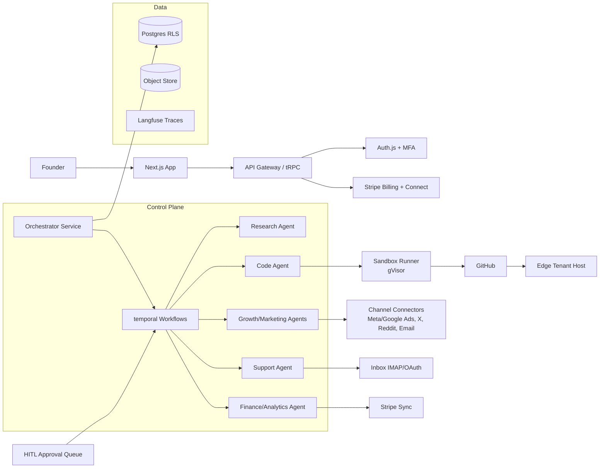

# Competitive Intelligence Report — Part 3: Clean-Room Architecture & Product Specification
Sections 7–8. Original design; no proprietary code or assets reproduced.

---

# 7. CLEAN-ROOM PRODUCT ARCHITECTURE

**Product concept (original)**: "Operator" — an autonomous business-operations platform with
two modes matching the validated demand: **Build mode** (idea → deployed product) and
**Operate mode** (daily agent cycles across marketing/support/ops), with a mandatory
approval-gate layer as the core differentiator (learned from Polsia's churn/complaints and
Okara's design choice).

## 7.1 Stack decisions (aligned with automsp-platform's existing Next.js 16 + Prisma stack)
| Layer | Choice | Rationale |
|---|---|---|
| Frontend | Next.js 16 App Router, React 19, Tailwind 4 | Already in-house; SSR for SEO + SPA-grade UX |
| Backend | Next.js Route Handlers + tRPC/Zod; heavy jobs extracted to worker service | One language; boundary at async work |
| Database | PostgreSQL (Prisma ORM) with row-level multi-tenancy (`tenant_id` on every table + Postgres RLS) | Proven; RLS = data isolation story |
| Auth | Auth.js (OAuth: Google/GitHub/email) + MFA (TOTP); sessions in httpOnly cookies | Standard, auditable |
| Billing | Stripe Billing (subscriptions, metered credits via Usage Records, Connect for tenant rev share) | Matches both competitors' verified stacks |
| AI orchestration | Agent runtime = queue-driven state machine per agent; model-agnostic provider layer (Claude/GPT/open-source) — avoids single-vendor lock-in that both competitors have | Cost routing + reliability |
| Agent execution | Temporal.io (durable workflows) for nightly cycles; each agent = workflow w/ retry, timeout, human-approval hooks | Scheduled autonomy needs durable execution, not cron |
| Sandboxing | Firecracker/Docker gVisor sandboxes for code-gen agents; short-lived tokens; egress allowlists | Code execution is the highest-risk surface |
| File storage | S3-compatible (R2) signed URLs | Cheap egress |
| Hosting | Fly.io/Vercel front; dedicated worker fleet; tenant sites on edge (subdomain + custom domain router like `*.platform.app`) | Both competitors run this exact tenant-hosting pattern |
| Queues/jobs | Temporal + Redis streams | |
| Observability | OpenTelemetry → Grafana stack; Sentry; Langfuse for LLM traces/costs | LLM cost observability is a must-have competitor gap |
| Analytics | PostHog (product) + GA4 + server-side CAPI conversions; host-allowlist pixel gating (adopting the proven pattern, implemented originally) | |
| Email/notifications | Resend/Postmark + digest composer | |
| Feature flags | PostHog flags / Unleash | |

## 7.2 Architecture diagram


## 7.3 Multi-tenancy & security architecture
- Every table carries `tenant_id`; Postgres RLS enforced via session var; integration tokens encrypted envelope-style (KMS) with per-agent ephemeral decryption grants
- Approval gate: any *external side effect* (publish, send, spend >$X, deploy) requires approval unless explicitly auto-armed by user per-category — the anti-Polsia positioning
- Budget guardrails: hard caps on ad spend + LLM credits per tenant/day; anomaly alerts
- Audit log: immutable event stream of every agent action (who/what/why/diff)
- Bot protection (Turnstile), rate limiting (per-IP + per-tenant), secrets never in prompts
- SOC 2 roadmap from day one: controls inventory + evidence pipeline (Vanta/Drata-class)

---

# 8. COMPLETE PRODUCT SPECIFICATION

## 8.1 Sitemap
```
/                    Landing (hero, how-it-works, pricing, social proof, FAQ+JSON-LD)
/pricing             Free / Pro / Business / Agency
/explore             Public directory of published tenant businesses (programmatic SEO)
/signup /login       OAuth + email; MFA enroll prompt post-first-login
/onboarding          Wizard (below)
/dashboard           Mission control: agent feed, KPIs, approvals, spend
/dashboard/approvals HITL queue (default tab)
/dashboard/[agent]   Per-agent detail: runs, outputs, settings, writing instructions
/dashboard/site      Generated site editor + domain management
/dashboard/analytics Traffic, revenue, agent ROI attribution
/settings            Profile, team, billing/credits, integrations, security, data/export/delete
/help                Public docs (NOT paywalled — deliberate contrast to Polsia)
/blog /changelog     Content + trust surfaces
```

## 8.2 Key screens

### Onboarding Wizard
1. **Purpose**: idea → running company <10 min (competitor benchmark: Polsia minutes-to-artifacts).
2. Components: stepped form, progress rail, live "agents working" terminal pane.
3. User actions: choose Build vs Grow; describe idea OR paste URL; pick autonomy level per category (Approve-all default / Auto-publish off by default); set budget caps.
4. Data: business description, industry, audience, offer; connected accounts (optional deferral).
5. Backend ops: create tenant, enqueue Research workflow, provision subdomain, generate strategy docs.
6. Analytics: `onboarding_started`, `mode_selected`, `autonomy_configured`, `first_artifact_ready` (TTV clock stops here), `onboarding_completed`.
7. Security: input sanitization, abuse heuristics on idea text (phishing/crypto/adult screening).
8. Success: ≥60% signup→first-artifact completion [EST target].

### Dashboard (Mission Control)
1. Purpose: single glance = what agents did, what awaits approval, money in/out.
2. Components: KPI strip (revenue, traffic, spend, tasks today), Agent Feed (chronological cards w/ diffs), Approvals inbox, Spend gauge vs cap.
3. Actions: approve/reject/edit-and-approve, reassign task, chat with an agent, top-up credits.
4. Data: task records, channel drafts, financial syncs.
5. Ops: read models from task store; webhook listeners per channel.
6. Analytics: `dashboard_viewed`, `approval_decision{type,latency}`, `agent_chat_opened`, `credits_low_warning`.
7. Security: all mutations authenticated + tenant-scoped + audit-logged.
8. Success: DAU/WAU >40% [EST]; median approval latency <12h.

### Approval Queue (differentiator screen)
1. Purpose: safe autonomy. Every external side effect lands here with context preview + risk badge (spend amount, channel policy warnings).
2–8: card list w/ bulk actions; events `bulk_approved`, `edit_before_approve`; success = zero unapproved external publishes (invariant tested in CI).

### Site Editor + Domains
Generated-site visual editor (sections, theme, copy) over the agent-written codebase; domain purchase/connect flow; SSL automation; rollback to prior deploys. Events: `site_edit_committed`, `domain_connected`, `deploy_succeeded`.

### Billing & Credits
Plans, usage meters (tasks, video minutes, seats), credit wallet w/ top-ups, invoices; rev-share dashboard for tenant earnings (Stripe Connect express). Events: `plan_upgraded`, `topup_purchased`, `revshare_payout_initiated`.

### Team & Settings
Roles Owner/Admin/Editor/Viewer; invite links (7-day expiry); read-only share links; export data (GDPR); delete account w/ 30-day grace; MFA enforcement option; active sessions list.

### State coverage (all screens)
- **Empty**: per-screen illustration + one-tap "generate first [artifact]" action
- **Loading**: skeleton + agent status ticker ("Competitor research: step 3/5")
- **Error**: retryable task cards w/ root-cause summary + "ask agent to fix" CTA
- **Permission**: locked features show required plan + upgrade path inline
- **Rate/budget**: spend-cap reached → pause banner + raise-cap flow

## 8.3 GA4 event taxonomy (recommended, legally-owned implementation)
Acquisition: `session_start`(auto), `signup_started`, `signup_completed{method}`
Activation: `company_created`, `research_completed`, `first_site_deployed`, `ttv_first_artifact` (timing event)
Usage: `task_executed{agent,type,cost}`, `credit_balance_below_20pct`
Conversion: `trial_started`, `trial_converted`, `plan_upgraded{from,to}`, `topup_purchased{amount}`
Retention: `digest_email_clicked`, `dashboard_return_7d`, `approval_latency_hours`
Value: `tenant_revenue_synced`, `revshare_collected`
Referral: `explore_listing_published`, `referral_link_visited`
Plus server-side Meta/Google conversion APIs mirroring trial/conversion events (the pattern Polsia's engineering confirms works).
